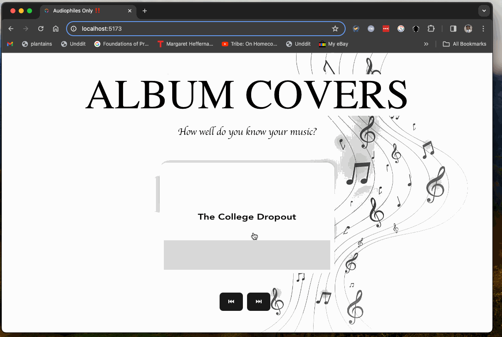
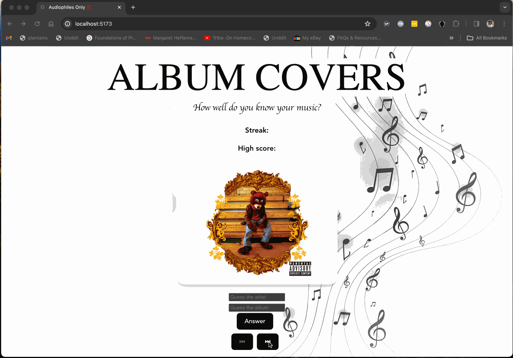

# Album Art Flashcards!

Created by: **Kevin Tusiime**

Dive into the visually stimulating world of album art with this interactive web app. "Album Art Flashcards" is an engaging tool designed to help users learn and memorize album covers from their favorite artists. Whether you're a music aficionado aiming to test your knowledge or simply looking to discover new art, this app brings an entertaining twist to the learning process.

Time spent: **9** hours spent in total

## Gameplay

Upon starting the app, users are greeted with a flashcard depicting an album cover on one side and the artist's name and album title on the back. The game's objective is straightforward yet captivating: to familiarize oneself with as many album covers as possible.

- **Front**: Displays the album art.
- **Back**: Reveals the artist's name and album title.

Users flip the flashcard to view the information on the reverse side, thus engaging in a self-paced, visually driven learning experience.

## Required Features

The following **required** functionality is completed:

- [x] The app introduces the flashcard set with a concise description, including the total number of flashcards available.
- [x] A single flashcard is shown at a time, with the album art displayed initially.
- [x] Implemented a collection of flashcard pairs, each consisting of an album cover and its corresponding artist and album title.
- [x] Upon interaction, the flashcard flips to show the artist's name and album title on the opposite side.
- [x] Users can navigate to a new flashcard, chosen at random, by clicking the "Next" button.

## Optional Features

The following **optional** features are implemented:

- [x] Integration with an Spotify API to fetch real-time data and album art.
- [x] Added visual effects (e.g., a "pulse" effect) on flashcard interactions for a more engaging user experience.

## Video Walkthrough

Here's a walkthrough of the implemented features:



## Notes
- Flipping the card was surprisingly complex.
- Learning to hook up the Spotify API was probably a bit overkill for this...


## Part II: Enhanced Interaction and Learning

### Overview
In "Album Art Flashcards! Part II", the app evolves to include interactive elements that allow users to engage more deeply with the material. Building on the foundation laid in Part I, Part II introduces features enabling users to test their recall more actively and navigate the flashcard set more freely.

#### Required Features
- [x] Users can now type their guesses into input boxes for both the artist and the album.
- [x] Users CANNOT flip cards without at least guessing either artist or album. 
- [x] A 'Submit' button allows users to submit their guesses and immediately see if they were correct or incorrect.
- [x] Correct and incorrect guesses are visually distinguished.
- [x] Users can navogate through ordered list of cards. 

#### Extra
- [x] The app dynamically disables the 'Back' or 'Next' buttons when the user is at the beginning or end of the flashcard set, respectively.
- [x] Fuzzy matching logic has been introduced to validate user inputs, allowing for minor variations in spelling or wording.
- [x] The UI has been updated to accommodate new features while maintaining a clean and engaging design.
- [ ] Shuffle button to reorder the the flashcard list.
- [ ] Counter to display longest streak
- [ ] User can mark card they mastered.

## Video Walkthrough

Here's a walkthrough of the implemented features:




## License

```
Copyright [2024] [Kevin Tusiime]

Licensed under the Apache License, Version 2.0 (the "License");
you may not use this file except in compliance with the License.
You may obtain a copy of the License at

    http://www.apache.org/licenses/LICENSE-2.0

Unless required by applicable law or agreed to in writing, software
distributed under the License is distributed on an "AS IS" BASIS,
WITHOUT WARRANTIES OR CONDITIONS OF ANY KIND, either express or implied.
See the License for the specific language governing permissions and
limitations under the License.
```
